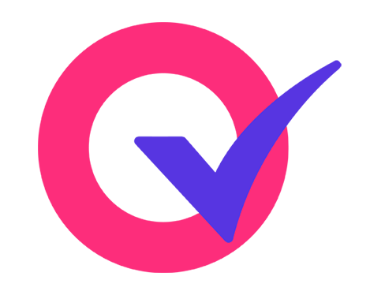

# 🌊 Riverborn

### We build AI systems that actually ship.

**Production-grade AI agents, voice systems, and creative AI infrastructure, built by a team that runs its own AI
products at scale.**

  
  
  
  
  

**Riverborn** is an AI systems development company and an
[OpenAI Select Partner](https://riverborn.com/blog/openai-select-partner). Based in Bangladesh with global delivery, we
design, build, and deploy production AI systems for startups, mid-market, and enterprise teams. Everything we build for
clients is first proven on products we run ourselves.

---

## 🚀 Products we run in production

Real products, real users, live today. Each one is the consumer proving ground for an enterprise system we deliver to
clients.

<table>
  <tr>
    <td width="33%" valign="top">
      
      <h3><a href="https://photofox.ai">PhotoFox AI</a></h3>
      Turn a photo into a branded campaign visual in seconds.  
      <b>50K+</b> creators, marketers and small businesses  
      Powers <a href="https://riverborn.com/systems/chitron"><b>Chitron AI</b></a> · E-commerce, Retail, D2C
    </td>
    <td width="33%" valign="top">
      
      <h3><a href="https://vocalo.ai">Vocalo AI</a></h3>
      Real-time AI voice coaching with live feedback on tone, clarity and pacing.  
      <b>100K+</b> voice interactions processed  
      Powers <a href="https://riverborn.com/systems/dhoni"><b>Dhoni AI</b></a> · BPO, Call Centers, Sales
    </td>
    <td width="33%" valign="top">
      
      <h3><a href="https://quizmakerai.org">QuizMaker AI</a></h3>
      Turn any document, PDF or topic into a structured quiz instantly.  
      Used by educators in <b>80+</b> countries  
      Powers <a href="https://riverborn.com/systems/jachai"><b>Jachai AI</b></a> · HR, Training, Compliance
    </td>
  </tr>
  <tr>
    <td width="33%" valign="top">
      
      <h3><a href="https://sketchtoimage.com">SketchToImage</a></h3>
      Turn hand-drawn sketches into polished visuals in one click.  
      For designers, architects and product teams  
      Powers <a href="https://riverborn.com/systems/rupon"><b>Rupon AI</b></a> · Architecture, Real Estate
    </td>
    <td width="33%" valign="top">
      
      <h3><a href="https://aistorygen.org">AiStoryGen</a></h3>
      Turn a brief into blog posts, social copy and scripts in minutes.  
      For solo creators and content teams  
      Powers <a href="https://riverborn.com/systems/rachona"><b>Rachona AI</b></a> · Marketing, EdTech, Publishing
    </td>
    <td width="33%" valign="middle" align="center">
      <a href="https://riverborn.com/case-studies"><b>See all case studies →</b></a>
    </td>
  </tr>
</table>

---

## 🧑‍💻 Open source

Production patterns from our client and product work, released so you can read the code, run it, and build on it.

| Project | What it is | Stack |
| :------ | :--------- | :---- |
| [**bangla-speech-to-text-benchmark**](https://github.com/riverbornai/bangla-speech-to-text-benchmark) | Open benchmark of 8 Bengali speech-to-text APIs on 1,001 real audio clips across 13 domains. CER, WER, latency and cost, batch and streaming. | Python |
| [**nongor**](https://github.com/riverbornai/nongor) | Local-first RAG chat that answers questions about your documents, with citations. | BGE-M3, LanceDB (dense + BM25), BGE reranker, FastAPI, Nuxt 3 |
| [**offline-ai-chat**](https://github.com/riverbornai/offline-ai-chat) | Chat and talk with an LLM fully on the phone. No server, no data leaving the device. | React Native (Expo), llama.cpp, Whisper, Piper / Kokoro |
| [**easy-draft**](https://github.com/riverbornai/easy-draft) | Multi-agent writing pipeline: brief in, researched LinkedIn / X / blog / email draft out, with guardrails and human approval. | OpenAI Agents SDK, GPT-4o, Claude, React, Express, MongoDB |
| [**interactive-3d-avatar-ai-agent**](https://github.com/riverbornai/interactive-3d-avatar-ai-agent) | Browser voice agent with a lip-synced 3D avatar and hands-free listening. | FastAPI, Deepgram, GPT-4o, Azure Speech, three.js |
| [**sharathi**](https://github.com/riverbornai/sharathi) | Self-hosted AI agent that answers Facebook Messenger for your business Pages, with a live dashboard. | Node.js, Express, Socket.IO, React, GPT-4o |
| [**jachai**](https://github.com/riverbornai/jachai) | AI quiz maker: text, PDFs, documents or images into a shareable, auto-scored quiz. | Nuxt 3, Express, MongoDB (Prisma), GPT-4o-mini |

⭐ If one of these saves you time, a star helps other builders find it.

---

## ✍️ From the engineering blog

- [How we built EasyDraft with the OpenAI Agents SDK](https://riverborn.com/blog/how-i-built-easydraft-openai-agents-sdk)
- [On-device RAG: how we built private document search](https://riverborn.com/blog/nongor-on-device-rag-architecture)
- [Offline voice AI: why more engine choices aren't always better](https://riverborn.com/blog/offline-speech-to-text-and-text-to-speech)
- [Why AI agents restart instead of resuming (and how to fix it)](https://riverborn.com/blog/why-ai-agents-restart-instead-of-resuming-and-how-to-fix-it)
- [Migrating a 40-agent sales system from Google ADK 1.x to ADK 2.0 workflows](https://riverborn.com/blog/migrating-a-sales-ai-system-from-adk-1x-to-adk-2-0-workflows)

More at [riverborn.com/blog](https://riverborn.com/blog).

---

## 🛠️ What we build for clients

- **Autonomous AI agents** that plan, execute multi-step work, self-correct, and keep persistent state.
- **Knowledge-aware conversational AI**: RAG-native assistants across text and voice channels.
- **Telephony-integrated voice AI** with real-time transcription, speech intelligence, and CRM sync.
- **Private AI cloud and on-premise** deployments for strict compliance and zero external API dependencies.
- **System-of-record integration**: models wired into your CRM, ERP, and HRIS through clean APIs.

### Why Riverborn

- **We are our own first customer.** The architecture you get already runs our products under real traffic, with
  observability, error budgets, and performance targets set before launch.
- **Founder-led architecture.** Our CEO leads the engineering design on every engagement. You work directly with the
  people designing your system.
- **OpenAI Select Partner**, earned on production systems already running and relied on worldwide.

<b>How engagements work</b>

 

Start with a 30-minute discovery call. From there:

- **AI Readiness Audit (2–4 weeks):** feasibility score, prioritized use cases, and a technical roadmap before you build.
- **30-Day AI Agent MVP (4 weeks):** a production-ready AI agent with fixed scope and no surprise charges.
- **AI Integration Sprint (4–6 weeks):** models and pipelines integrated into your existing systems.
- **AI Workflow Automation Audit (2–3 weeks):** bottleneck mapping and ROI projections.

---

## 👥 Team

- **Nasim Uddin**, Founder & CEO ([LinkedIn](https://www.linkedin.com/in/nasimuddin01/) · [X](https://x.com/nasimuddin01)): leads technical architecture across voice, agents, and generative systems.
- **Nasir Uddin**, Co-Founder & COO ([LinkedIn](https://www.linkedin.com/in/nasir01/) · [X](https://x.com/nasir_uddin01)): operations, delivery, and compliance.
- **Raihan Ahmed**, Co-Founder & CMO ([LinkedIn](https://www.linkedin.com/in/devraihanahmad/) · [X](https://x.com/devraihanahmad)): brand, positioning, and matching solutions to client needs.

---

## 📬 Get in touch

- 🌐 [riverborn.com](https://riverborn.com)
- ✉️ [hello@riverborn.com](mailto:hello@riverborn.com)
- 💼 [LinkedIn](https://www.linkedin.com/company/74964253) · 𝕏 [@riverbornai](https://x.com/riverbornai)
- 📅 [Book a 30-minute discovery call](https://riverborn.com#contact)
